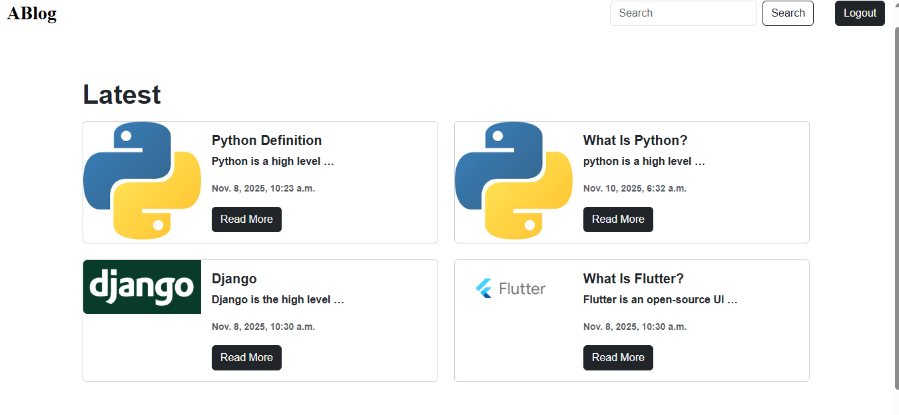
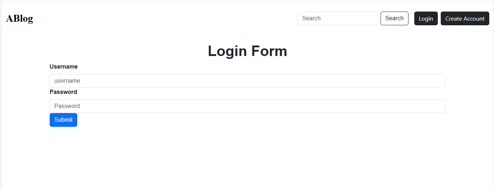
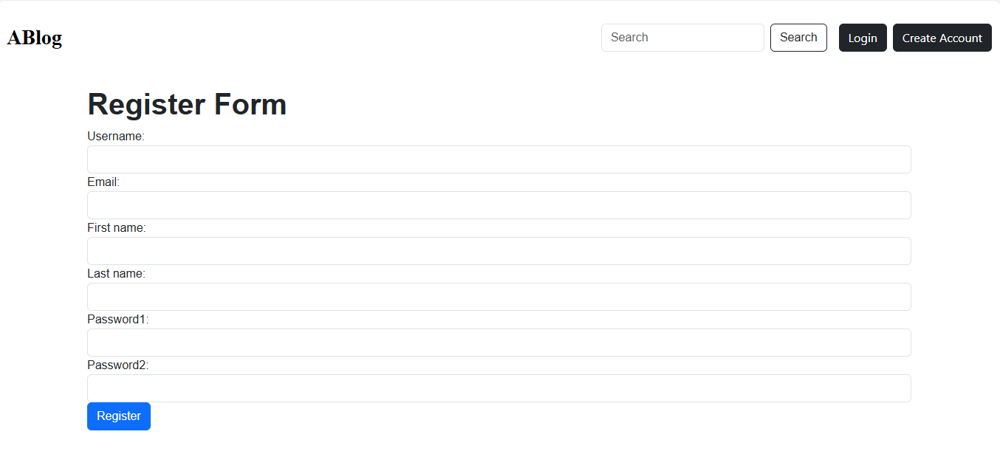

A simple Blog Application built with Django that allows users to create, edit, and delete blog posts.  

# Features
- User authentication (login, logout, register)
- Create, read, update, and delete blog posts (CRUD)
- Image upload for blog posts
- Comment section
- Responsive UI (Bootstrap)

# Tech Stack
Backend: Django, Python  
Frontend:HTML, CSS, Bootstrap 
Database: SQLite (default)  
Version Control:Git, GitHub  

## Installation & Setup

Follow these steps to run the project locally:

```bash
# Clone the repository
git clone https://github.com/sabinameche/blog_app
cd blog_app

# Create a virtual environment
python -m venv venv

# Activate it
# On Windows
venv\Scripts\activate
# On Mac/Linux
source venv/bin/activate

# Install dependencies
pip install -r requirements.txt

# Run migrations
python manage.py makemigrations
python manage.py migrate

# Start the server
python manage.py runserver
```
# and visit the url 

# Screenshots of the blog
Home page

Login Page

Register Page
